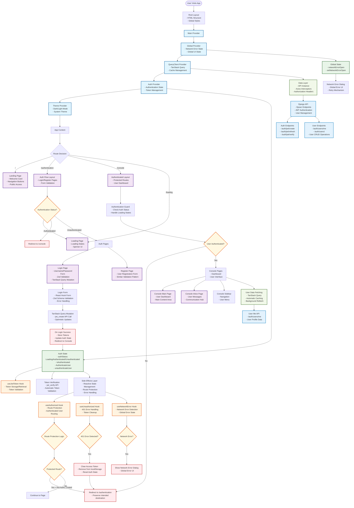

# Application Flow Architecture Diagram

## Subject: Next.js Authentication Application with TanStack Query & Djoser Integration

This diagram visualizes the complete architecture, data flow, and state management in your Next.js authentication application built with TanStack Query, Djoser backend integration, and sophisticated side effects pattern.



## Key Architectural Patterns

### 1. **Provider Hierarchy & State Management**
- **GlobalProvider**: Manages global UI state (network errors, global dialogs)
- **QueryClientProvider**: Handles data fetching, caching, and synchronization with TanStack Query
- **AuthProvider**: Manages authentication state with enum-based status (Loading/Authenticated/Unauthenticated)
- **ThemeProvider**: Handles dark/light mode with system preference detection

### 2. **Side Effects Pattern (Reactive Architecture)**
Your app uses a sophisticated side effects pattern where each hook has a single responsibility:
- **useAuthorized**: Handles route protection and authenticated user routing
- **useUnauthorized**: Manages 401 errors and automatic token cleanup
- **useNetworkError**: Detects network failures and shows global error dialogs
- **useJwtToken**: Manages token storage, retrieval, and validation lifecycle

### 3. **Data Layer Architecture**
- **API Instance**: Centralized Axios configuration with interceptors
- **Authorization Headers**: Automatic token injection for authenticated requests
- **Django Integration**: Seamless integration with Djoser authentication backend
- **Type Safety**: Full TypeScript integration with proper API response typing

### 4. **Route Protection & Navigation**
- **Protected Routes**: `/console` - requires authentication with automatic redirect
- **Auth Flow Routes**: `/authentication` - handles login/register with form validation
- **Public Routes**: `/` (landing) and `/loading` - accessible to all users
- **Smart Redirects**: Preserves intended destination for post-login navigation

### 5. **Authentication Flow**
1. **App Initialization**: Check for existing tokens in localStorage
2. **Token Validation**: Automatic verification via `jwt_verify` API
3. **State Management**: Enum-based authentication status with reactive updates
4. **Side Effects**: Automatic routing and error handling based on auth state
5. **Token Refresh**: Built-in token refresh mechanism (when implemented)

### 6. **Error Handling Strategy**
- **401 Errors**: Automatic token cleanup and redirect to authentication
- **Network Errors**: Global error dialog with retry mechanism
- **Form Validation**: Zod schema validation with user-friendly error messages
- **API Errors**: Structured error handling with proper TypeScript typing

### 7. **Performance Optimizations**
- **TanStack Query**: Intelligent caching, background refetching, and optimistic updates
- **Code Splitting**: Route-based code splitting with Next.js App Router
- **Lazy Loading**: Dynamic imports for better initial load performance
- **Memoization**: React.memo and useMemo for expensive computations

## Technical Implementation Details

### **Authentication State Management**
```typescript
enum AuthenticationStatus {
  Loading = "Loading",
  Authenticated = "Authenticated", 
  Unauthenticated = "Unauthenticated"
}
```

### **API Integration Pattern**
- **Base URL**: Configurable Django backend endpoint
- **Interceptors**: Automatic authorization header injection
- **Error Handling**: Centralized error processing with type safety
- **Request/Response**: Full TypeScript typing for all API calls

### **Form Handling**
- **React Hook Form**: Efficient form state management
- **Zod Validation**: Runtime type checking and validation
- **Error Display**: User-friendly error messages with proper UX

### **Route Protection Logic**
- **Layout-based Protection**: Authentication checks at layout level
- **Side Effect Hooks**: Reactive routing based on authentication state
- **Loading States**: Proper loading UI during authentication checks

## Benefits of This Architecture

### **1. Separation of Concerns**
- Each provider manages a specific domain (auth, global state, data fetching)
- Side effects are isolated and testable
- Clear boundaries between UI, business logic, and data layers

### **2. Reactive State Management**
- UI automatically updates based on authentication state changes
- Side effects react to state changes without manual intervention
- Consistent user experience across all routes

### **3. Type Safety & Developer Experience**
- Full TypeScript integration with proper typing
- IntelliSense support for all API calls and state
- Compile-time error detection for better code quality

### **4. Performance & Scalability**
- TanStack Query for efficient data fetching and caching
- Optimistic updates for better perceived performance
- Background refetching keeps data fresh
- Code splitting reduces initial bundle size

### **5. Error Boundaries & Resilience**
- Centralized error handling for different error types
- Graceful degradation on network failures
- Automatic token cleanup on authentication errors
- User-friendly error messages and recovery options

### **6. Maintainability & Testing**
- Clear architectural patterns make code easy to understand
- Isolated side effects are easy to test
- Provider pattern enables easy mocking for tests
- Consistent patterns across the application

## Future Enhancements & Recommendations

### **1. Token Refresh Implementation**
- Implement automatic token refresh before expiration
- Add refresh token rotation for enhanced security
- Handle concurrent requests during token refresh

### **2. Offline Support**
- Add service worker for offline functionality
- Cache critical data for offline access
- Queue mutations for when connection is restored

### **3. Enhanced Error Handling**
- Add retry mechanisms for failed requests
- Implement exponential backoff for network errors
- Add error reporting and monitoring

### **4. Performance Monitoring**
- Add performance metrics and monitoring
- Implement bundle analysis and optimization
- Add Core Web Vitals tracking

### **5. Security Enhancements**
- Implement CSRF protection
- Add request rate limiting
- Enhance token security with httpOnly cookies (if applicable)

## Summary

This architecture represents a modern, scalable approach to building authentication-enabled Next.js applications. The combination of:

- **TanStack Query** for sophisticated data management
- **Provider-based state management** for clean separation of concerns
- **Side effects pattern** for reactive UI behavior
- **TypeScript integration** for type safety and developer experience
- **Djoser backend integration** for robust authentication

Creates a solid foundation for building production-ready applications with excellent user experience, maintainable code, and robust error handling.

The architecture is designed to scale with your application needs while maintaining simplicity and clarity in the codebase. Each pattern serves a specific purpose and works together to create a cohesive, reliable system.
