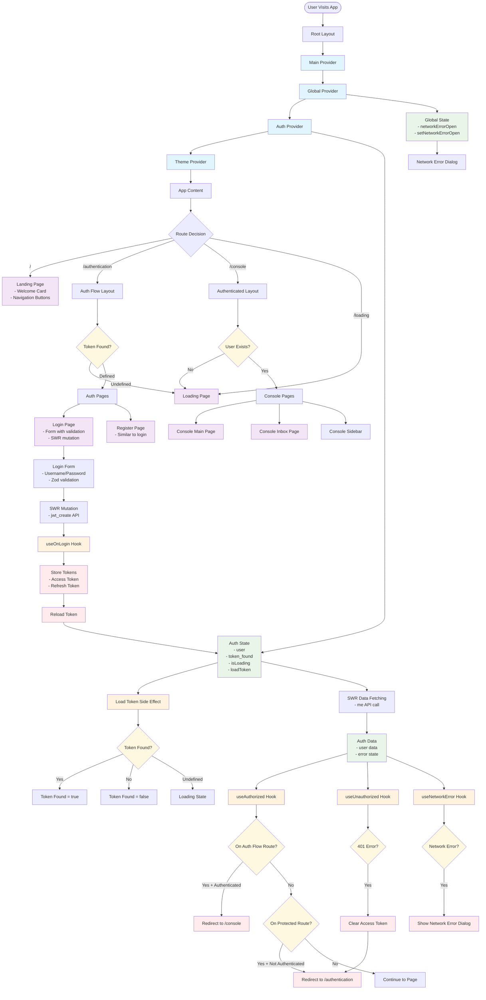

# Application Flow Architecture Diagram

## Subject: Application Flow Architecture and State Management

This diagram visualizes the flows, pages, and side effects in your Next.js authentication application.

## Key Architectural Patterns

### 1. **Provider Hierarchy**
- **GlobalProvider**: Manages global UI state (network errors)
- **AuthProvider**: Manages authentication state and side effects
- **ThemeProvider**: Handles theming

### 2. **Side Effects Pattern**
Your app uses a sophisticated side effects pattern where:
- **useLoadToken**: Checks for existing tokens on app load
- **useAuthorized**: Handles routing for authenticated users
- **useUnauthorized**: Handles 401 errors and token cleanup
- **useNetworkError**: Manages network error dialogs
- **useOnLogin**: Handles successful login token storage

### 3. **Route Protection**
- **Protected Routes**: `/console` - requires authentication
- **Auth Flow Routes**: `/authentication` - redirects authenticated users
- **Public Routes**: `/loading` - accessible to all

### 4. **State Management Flow**
1. App loads → Check for existing token
2. If token exists → Fetch user data via SWR
3. Side effects react to auth state changes
4. Routing decisions based on auth state and current route

### 5. **Error Handling**
- **401 Errors**: Clear tokens and redirect to auth
- **Network Errors**: Show global error dialog
- **API Errors**: Display in form components

## Benefits of This Architecture

1. **Separation of Concerns**: Each side effect has a single responsibility
2. **Reactive State**: UI automatically updates based on auth state changes
3. **Type Safety**: Full TypeScript integration with proper typing
4. **Error Boundaries**: Centralized error handling for different error types
5. **Performance**: SWR for efficient data fetching and caching
